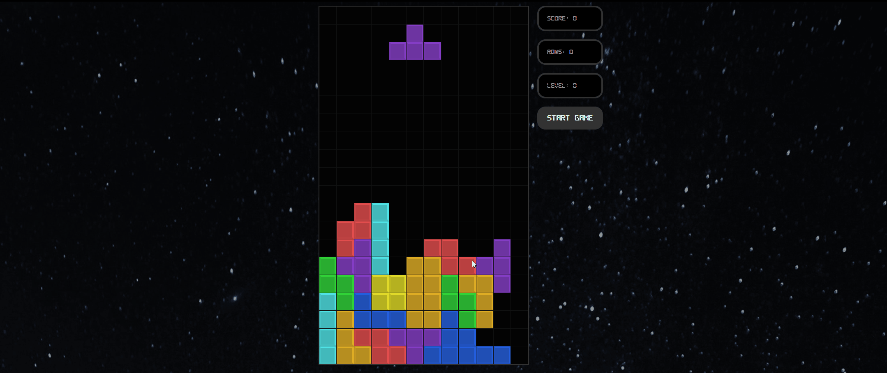

<h1 style="color: #888" align="center">
    Tetris
</h1>

  

    
    
    
    
  

>

## 💻 Project

A Tetris app that was made using React and Styled Components. The main objective is to learn more about React and improve my data structure skills.

>

  

>

## 🔨 If you want to try this project

In the project directory, you can run:

### `yarn start`

Runs the app in the development mode. 
Open [http://localhost:3000](http://localhost:3000) to view it in the browser.

>

## 🚀 Technologies

This project was developed with the following technologies:

- React
- Styled Components

>

## 👊🏼 Contributing
You are totally allowed to contribute with this project. To do that, fork this repository, make your changes and create a pull request.

> >

<h4 align="center">
    Made by <a href="https://www.linkedin.com/in/figortmartins/" style="color: #00a0df" target="_blank">Igor Martins</a>
</h4>